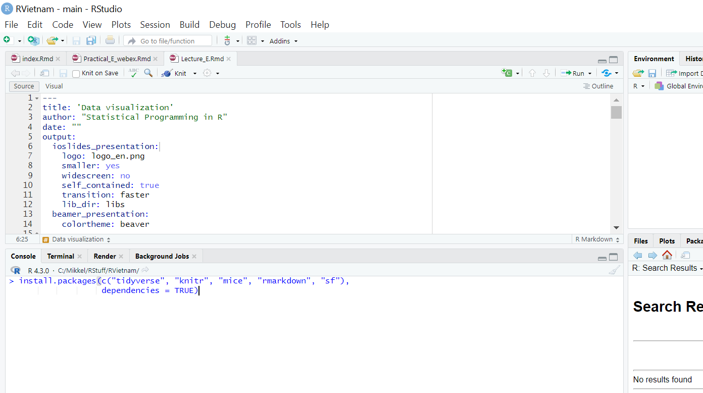

<!-- ```{r setup, include=FALSE} -->
<!-- knitr::opts_chunk$set(echo = TRUE) -->
<!-- library(vembedr) -->

<!-- ``` -->


# Intro {.sidebar}

This dashboard covers the materials for the course introducing R. Course held in Vietnam, May 8 - May 12, 2023.

---

Instructors: 

 - Signe Hermann (she@dst.dk)
 - Mikkel Mollerup (mim@dst.dk)


---

Material adopted from Statistics Denmark and [Gerko Vink](https://github.com/gerkovink/R).


---
# Quick Overview

## Column 1

### Outline
R is rapidly becoming the standard platform for data manipulation, visualization and analysis and has a number of advantages over other statistical software packages. A wide community of users contribute to R, resulting in an enormous coverage of statistical procedures, including many that are not available in any other statistical program. Furthermore, it is highly flexible for programming and scripting purposes, for example when manipulating data or creating professional plots. However, R lacks standard GUI menus, as in SPSS for example, from which to choose what statistical test to perform or which graph to create. As a consequence, R is more challenging to master. Therefore, this course offers an introduction to statistical programming in R. Students learn to operate R, make plots, and do advanced statistical programming and data manipulation. 


The course starts at a very basic level and builds up gradually. No previous experience with R is required.

## Column 2

### Course schedule 

| Time        | Topic                                           |
|:------------|:------------------------------------------------|
| *Monday*    |                                                 |
| 09.00-11.30 | Introduction to R and RStudio (A)               |
|             | *Break*                                         |
| 13.30-16.30 | How is R organized? (B)                         |                 
| *Tuesday*   |                                                 |
| 08.30-11.30 | Data manipulation (C)                           |
|             | *Break*                                         |     
| 13.30-16.30 | Analyzing data (D)                              |
| *Wednesday*                                                   |
| 08.30-11.30 | Data visualization (E)                          |
|             | *Break*                                         |             
| 13.30-16.30 | Loops and functions (F)                         |
| *Thursday*  |                                                 |
| 08.30-11.30 | Linear regression and R Markdown, lecture (G)   |
|             | *Break*                                         |
| 13.30-16.30 | Outstanding issues, Q and A                     |


# How to prepare

## Column 1

### Preparing your machine for the course
Dear all, 

The below steps guide you through installing both `R` as well as the necessary additions.

We look forward to see you all in Hanoi,  

*Signe and Mikkel*

### **System requirements**

Bring a laptop computer to the course and make sure that you have full write access and administrator rights to the machine. We will explore programming and compiling in this course. This means that you need full access to your machine. Some corporate laptops come with limited access for their users, we therefore advice you to bring a personal laptop computer, if you have one. 

### **1. Install `R`**
`R` can be obtained [here](https://cran.r-project.org). We won't use `R` directly in the course, but rather call `R` through `RStudio`. Therefore it needs to be installed. 

### **2. Install `RStudio` Desktop**

Rstudio is an Integrated Development Environment (IDE). It can be obtained as stand-alone software [here](https://www.posit.co/downloads/). The free and open source `RStudio Desktop` version is sufficient.

### **3. Start RStudio and install the following packages. **

Execute the following lines of code in the console window:

```{r eval=FALSE, echo = TRUE}
install.packages(c("tidyverse", "knitr", "mice", "rmarkdown", "sf"),
                 dependencies = TRUE)
```

<!-- ```{r eval=FALSE, echo = TRUE} -->
<!-- install.packages(c("ggplot2", "stats","tidyverse", "magrittr", "micemd", "jomo", "pan",  -->
<!--                  "lme4", "knitr", "rmarkdown", "plotly", "ggplot2", "shiny",  -->
<!--                  "devtools", "boot", "class", "car", "MASS", "ggplot2movies",  -->
<!--                  "ISLR", "DAAG", "mice", "mitml", "miceadds", "sf"),  -->
<!--                  dependencies = TRUE) -->
<!-- ``` -->


If you are not sure where to execute code, use the following figure to identify the console:


<left>
  
</left>

Just copy and paste the installation command and press the return key. When asked 

```{r eval = FALSE, echo = TRUE}
Do you want to install from sources the package which needs 
compilation? (Yes/no/cancel)
```

type `Yes` in the console and press the return key. 

# Monday

## Column 1

### Day 1's materials
We adapt the course as we go. To ensure that you work with the latest iteration of the course materials, we advice all course participants to access the materials online.

- Part A: Introduction
    - [Lecture A](Contents/Part_A/Lecture_A.html){target="_blank"}
    - [Practical A](Contents/Part_A/Practical_A_webex.html){target="_blank"}
- Part B: How is `R` organized?
    - [Lecture B](Contents/Part_B/Lecture_B.html){target="_blank"}
    - [Practical B](Contents/Part_B/Practical_B.html){target="_blank"}
    - [Practical B with solutions](Contents/Part_B/Practical_B_walkthrough.html){target="_blank"}
    - [`boys.RData`](Contents/Part_B/boys.RData) data set

All lectures are in `html` format. Practicals are provided both as naked questions but also with ample explanations and solutions - choose according to your taste!


## Column 2

### Useful references

- [The tidyverse style guide](https://style.tidyverse.org)

The above links are useful references that connect to today's materials. 

### About `rmarkdown`


<iframe src="https://player.vimeo.com/video/178485416?color=428bca&title=0&byline=0&portrait=0" data-external= "1"
height = "300" width="450" frameborder="0"> </iframe>

<br>
See also [this `R Markdown` cheat sheet](Contents/Part_A/rmarkdown_cheat_sheet.pdf).

# Tuesday

## Column 1

### Day 2's materials
We adapt the course as we go. To ensure that you work with the latest iteration of the course materials, we advice all course participants to access the materials online.

- Part C: Data manipulation
    - [Lecture C](Contents/Part_C/Lecture_C.html)
    - [Practical C](Contents/Part_C/Practical_C_webex.html)
- Part D: Analyzing data
    - [Lecture D](Contents/Part_D/Lecture_D.html)
    - [Practical D](Contents/Part_D/Practical_D.html)
    - [Practical D with solutions](Contents/Part_D/Practical_D_walkthrough.html)

All lectures are in `html` format. Practicals are provided both as naked questions but also with ample explanations and solutions - choose according to your taste!

## Column 2

### Useful references
<!-- - [The Google R style guide](https://google.github.io/styleguide/Rguide.xml) -->
- [`magrittr`](https://magrittr.tidyverse.org)
- [`R` for Data Science](http://r4ds.had.co.nz) - [Chapter 18 on pipes](http://r4ds.had.co.nz/pipes.html)
- [R-bloggers tutorial on pipes](https://www.r-bloggers.com/2017/12/pipes-in-r-tutorial-for-beginners/)
- [pipe tutorial on datacamp](https://www.datacamp.com/community/tutorials/pipe-r-tutorial)

The above links are useful references that connect to today's materials.

# Wednesday

## Column 1

### Day 3's materials
We adapt the course as we go. To ensure that you work with the latest iteration of the course materials, we advice all course participants to access the materials online.

- Part E: Data visualization
    - [Lecture E](Contents/Part_E/Lecture_E.html){target="_blank"}
    - [Practical E](Contents/Part_E/Practical_E_webex.html){target="_blank"}
    - [`DK_map.shp`](Contents/Part_E/DK_map.shp), [`DK_map.shx`](Contents/Part_E/DK_map.shx), [`DK_map.dbf`](Contents/Part_E/DK_map.dbf) shapefiles for mapping data on Danish municipalities
- Part F: Loops and functions
    - [Lecture F](Contents/Part_F/Lecture_F.html){target="_blank"}
    - [Practical F](Contents/Part_F/Practical_F.html){target="_blank"}
    - [Practical F with solutions](Contents/Part_F/Practical_F_walkthrough.html){target="_blank"}
    
All lectures are in `html` format. Practicals are provided both as naked questions but also with ample explanations and solutions - choose according to your taste!

<!-- All lectures are in `html` format. Practicals are walkthrough files that guide you through the exercises. `Impractical` files contain the exercises, without walkthrough, explanations and solutions. -->

## Column 2

### Useful references

<!-- - [`magrittr`](https://magrittr.tidyverse.org) -->
<!-- - [`R` for Data Science](http://r4ds.had.co.nz) - [Chapter 18 on pipes](http://r4ds.had.co.nz/pipes.html) -->
- [The `ggplot2` reference page](https://ggplot2.tidyverse.org/reference/)

The above link details pretty much all you can do with package `ggplot2`.

- [Geocomputation with `R`](https://bookdown.org/robinlovelace/geocompr/)

The `sf` setup for `R` is relatively new, and a lot of material about spatial data in `R` uses the older `sp` setup. This book is an introduction to spatial data the `sf` way.


# Thursday

## Column 1

### Day 4's materials
We adapt the course as we go. To ensure that you work with the latest iteration of the course materials, we advice all course participants to access the materials online.

- Part G: Linear regression and R Markdown
    - [Linear Regression](Contents/Part_G/Linear_Regression.html){target="_blank"}
    - [Lecture G](Contents/Part_G/Lecture_G.html){target="_blank"}
    - [Practical G](Contents/Part_G/Practical_G_webex.html){target="_blank"}

All lectures are in `html` format. Practicals are provided both as naked questions but also with ample explanations and solutions - choose according to your taste!


## Column 2

### Useful references

- [Create awesome HTML tables with `knitr::kable` and `kableExtra`](https://cran.r-project.org/web/packages/kableExtra/vignettes/awesome_table_in_html.html)

- [R Markdown Cookbook](https://bookdown.org/yihui/rmarkdown-cookbook/)


# Misc

## column 1

### Miscellaneous

<!-- In the example we -->

<!-- - Read and write data in different formats -->
<!-- - Learn about file paths -->
<!-- - Learn to find and set working directory -->
<!-- - Make a two-way table -->
<!-- - Make a scatter plot in ggplot -->
<!-- - Draw a sample -->
<!-- - Make a scatter plot with regression line -->

<!-- Example code and data: -->

<!-- - [`Example_GSS.R`](Contents/Material/GSS/Example_GSS.R){target="_blank"}  R file! -->
<!-- - [`00_GHA_BASICINFO.dta`](Contents/Material/GSS/00_GHA_BASICINFO.dta){target="_blank"}  GSS Stata file -->
<!-- - [`01_GHA_EXPFOOD.dta`](Contents/Material/GSS/01_GHA_EXPFOOD.dta){target="_blank"} GSS Stata file -->
<!-- - [`glss7.csv`](Contents/Material/GSS/glss7.csv){target="_blank"} GSS csv file -->
<!-- - [`glss7.xlsx`](Contents/Material/GSS/glss7.xlsx){target="_blank"} GSS Excel file -->


# Further studies

## Column 1

### What to do after the course

The following references are currently available for free, either as pdfs or as extensive webpages (written with [RMarkdown](https://rmarkdown.rstudio.com/) and [bookdown](https://bookdown.org/)). They are all very useful and we highly recommend them. 

- [R for Data Science](https://r4ds.had.co.nz): written by Hadley Wickham and Garrett Grolemund this book relies almost exclusively on the [tidyverse](https://www.tidyverse.org/) approach to data analysis. Many highly effective tools will be right at your fingertips after reading this book and working through the many exercises.
- [Hands-On Programming with R](https://rstudio-education.github.io/hopr/): a great read by Garrett Grolemund emphasizing programming techniques with R. 
- [Advanced R](https://adv-r.hadley.nz/): You want to gain deeper knowledge of R and you wnat to learn from one of the most influential R contributors. This one is for you!
- [Introduction to Statistical Learning](http://faculty.marshall.usc.edu/gareth-james/ISL/): an introductory book on statistical learning, with applications in R. The R code is somewhat old-style and you might be able to find newer packages for the tasks, but ths is a solid read well worth the effort.
- [Data Analysis and Graphics Using R](http://www.pindex.com/uploads/post_docs/Maindonald%20Data%20Analysis%20and%20Graphics(PINDEX-DOC-6953).pdf): a detailed book that covers a lot about categorical data analysis and fitting `glm`s in `R`.
- [Happy Git and GitHub for the useR ](https://happygitwithr.com/index.html): a great introduction to version control using Git and GitHub together with RStudio. Written by Jenny Bryan in a very concise style. Highly recommended!

<!-- ## Column 2 -->

<!-- ### For fun -->
<!-- <blockquote class="twitter-tweet" data-lang="en"><p lang="en" dir="ltr">My wife asked me what machine learning is and I said: remember when we ordered the hot plate for the boat and amazon suggested buying all the equipment needed to make a full meth lab?</p>&mdash; (((Kane Baccigalupi))) (@rubyghetto) <a href="https://twitter.com/rubyghetto/status/1058220004301127680?ref_src=twsrc%5Etfw">November 2, 2018</a></blockquote> -->
<!-- <script async src="https://platform.twitter.com/widgets.js" charset="utf-8"></script> -->